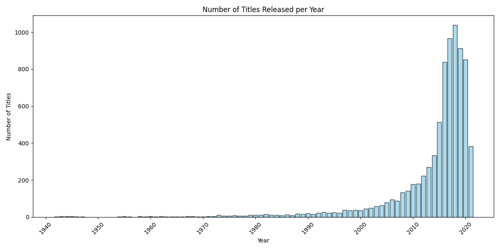
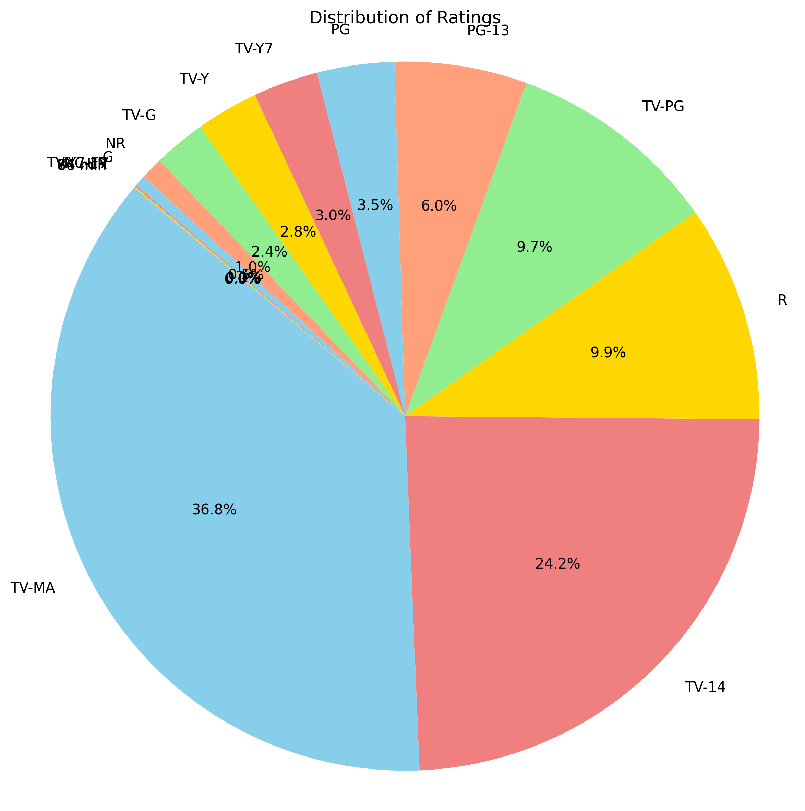

# 📊 Netflix Data Analysis with Python

A data visualization and analysis project using **Pandas** and **Matplotlib** on Netflix's global content dataset.

## 🔍 Key Insights Visualized
- **Titles Released Per Year** (Bar Graph)
- **Content Rating Distribution** (Pie Chart)
- **Movie Duration Trends** (Histogram)
- **Release Year Trends** (Scatter Plot)
- **Top Countries by Show Count** (Horizontal Bar Chart)

## 🛠 Tools & Libraries Used
- Python
- Pandas
- Matplotlib

## 📂 Files
- `main_1.py`: Main analysis script
- `.png` files: Graphs generated from the script

## 📷 Sample Visuals



---

## 📌 How to Run
1. Download `netflix_project.csv` (not included here for licensing reasons)
2. Place it in the same folder as `main_1.py`
3. Run:
```bash
python main_1.py
